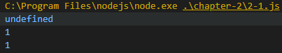
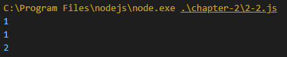
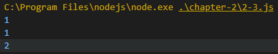
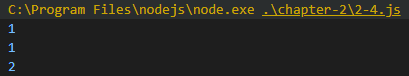
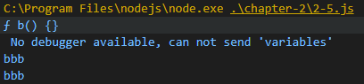
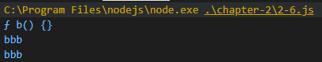
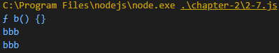
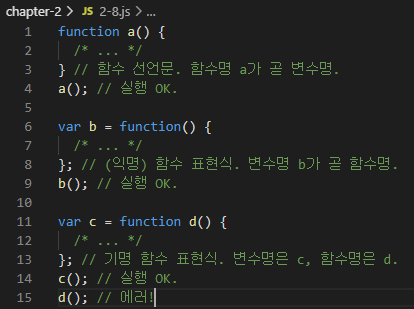

# Internet of Things Homwork #1
## Chapter 2

### 2-1 매개 변수 호이스팅

### 2-2 변수 선언 위치에 따른 호이스팅

### 2-3 변수 선언 및 할당 위치에 따른 호이스팅

### 2-4 변수 선언 부분과 할당 부분을 나눠 호이스팅

### 2-5 함수 선언에 대한 호이스팅

### 2-6 변수 선언, 함수 선언 호이스팅

### 2-7 변수 선언 및 할당, 함수 선언 위치에 따른 호이스팅

### 2-8 함수 표현식과 함수선언문의 위험성
