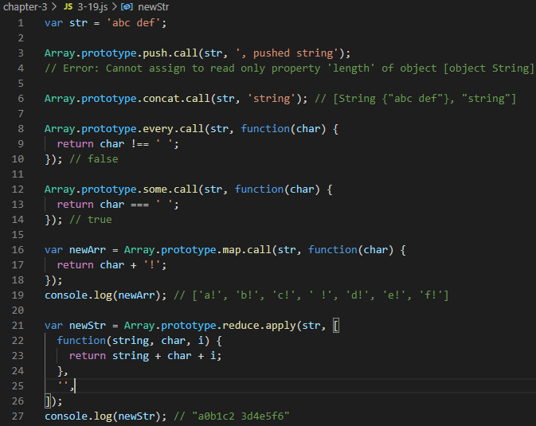
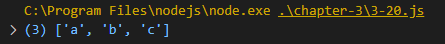
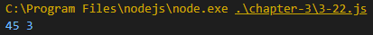
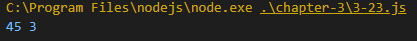

# Internet of Things Homwork #1
## Chapter 3

### 3-1 전역 공간에서 this (브라우저 환경: window)

### 3-2 전역 공간에서 this (브라우저 환경: global)

### 3-3 전역 공간에서만 발생하는 특이한 성질

### 3-4 전역 변수와 전역 객체의 프로퍼티 할당

### 3-5 전역 변수와 전역 객체의 프로퍼티 삭제

### 3-6 함수 vs. 메서드

### 3-7 함수로서 호출과 메서드로서 호출 구분 방법

### 3-8 메서드 내부에서의 this

### 3-9 메서드 내부 함수에서의 this

### 3-10 메서드 내부 함수에서의 this를 우회하는 방법

### 3-11 this를 바인딩하지 않는 함수

### 3-12 콜백 함수 호출 시 그 함수 내부에서의 this

### 3-13 생성자 함수 내부에서의 this

### 3-14 함수 call 메서드

### 3-15 객체 call 메서드

### 3-16 apply 메서드

### 3-17 유사 배열 객체세 배열 메서드를 적용 (call / apply 메서드의 활용)

### 3-18 유사 배열 객체세 배열 메서드를 적용 (call / apply 메서드의 활용)-2

### 3-19 약간의 제약이 있는 유사배열 객체의 예

### 3-20 ES6에서 새롭게 도입 된 Array.from

### 3-21 생성자 내부에서 다른 생성자 호출

### 3-22 여러 인수를 묶어 하나의 배열로 전달하고 싶을때 (apply 활용)

### 3-23 Math.max / Math.min에 apply 적용
