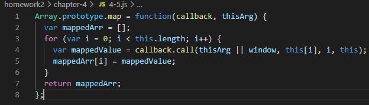
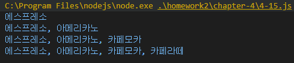

# Internet of Things Homwork #2
## Chapter 4

### 4-1 setInterval

### 4-2 setInterval cbFunc 명시적 표현

### 4-3 Array.prototype.map

### 4-4 Array.prototype.map 인자 순서 변경

### 4-5 Array.prototype.map 구현

### 4-6 addEventListener

### 4-7 메서드를 콜백 함수로 전달

### 4-8 콜백 함수 내부의 this에 다른 값 바인딩하기 (전통적인 방식)

### 4-9 콜백 함수 내부의 this에 다른 값 바인딩하기 (this를 사용하지 않은 경우)

### 4-10 콜백 함수 내부의 this에 다른 값 바인딩하기 (func 함수 재활용)

### 4-11 콜백 함수 내부의 this에 다른 값 바인딩하기 (bind 메서드 활용)

### 4-12 콜백 지옥

### 4-13 콜백 지옥 해결 및 기명 함수로 변환

### 4-14 비동기 작업의 동기적 표현 (1)

### 4-15 비동기 작업의 동기적 표현 (2)
