# Internet of Things Homwork #2
## Chapter 5

### 5-1 클로저: 어떤 함수에서 선언한 변수를 참조하는 내부함수에서만 발생하는 현상

### 5-2 inner 함수를 실행관 결과를 리턴하고 있으므로 outer 함수의 실행 컨텍스트가 종료된 시점에는 a 변수를 참조하는 대상이 없어짐.

### 5-3 외부 함수의 변수를 참조하는 내부함수
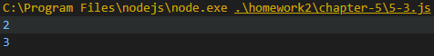

### 5-4 setInterval/setTimeout
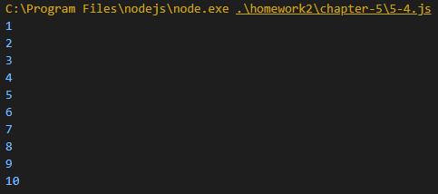

### 5-4(1) eventListener
.PNG)

### 5-5 return에 의한 클로저의 메모리 해제
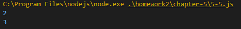

### 5-5(1) setInterval에 의한 클로저의 메모리 해제
.PNG)

### 5-5(2) eventListener에 의한 클로저의 메모리 해제
.PNG)

### 5-6 콜백 함수 내부에서 외부 데이터를 사용하고자 할 때
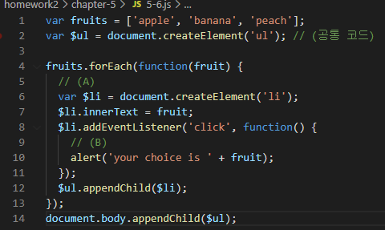

### 5-7 호출
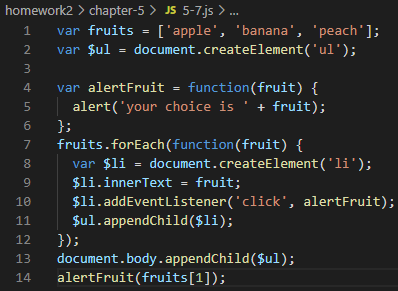

### 5-8 bind 사용
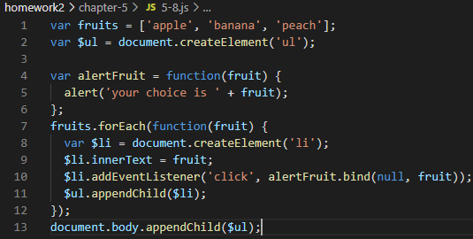

### 5-9 fruit를 인자로 받아 출력하는 형태
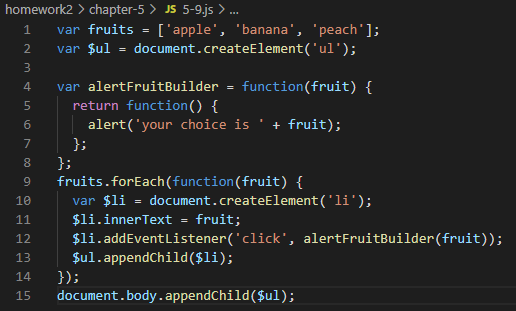

### 5-10 접근 권한 제어
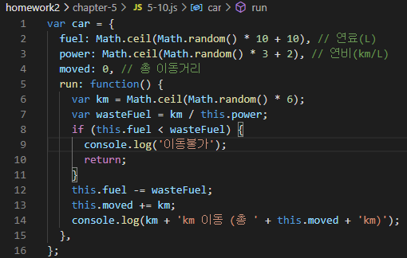

### 5-11 클로저를 활용해서 객체가 아닌 함수로 만들고, 필요한 멤버만을 return
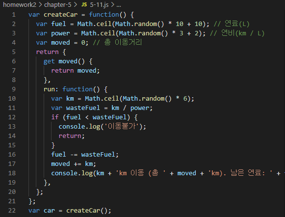

### 5-12 어뷰징까지 막기 위해서는 객체를 return하기 전에 미리 변경할 수 없게끔 조치
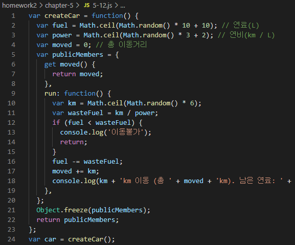

### 5-13 부분 적용 함수
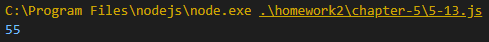

### 5-14 첫 번째 인자에는 원본함수를, 두 번째 인자 이후부터는 미리 적용할 인자들을 전달. 반환할 함수(부분 적용함수)에서는 다시 나머지 인자들을 받아 이들을 한데 모아(concat) 원본 함수를 호출(apply). 실행 시점의 this를 그대로 반영함으로써 this에는 아무런 영향을 주지 않게 됨.
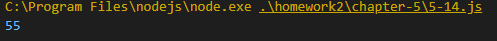

### 5-15 부분 적용 함수

### 5-16 예제

### 5-17 커링함수
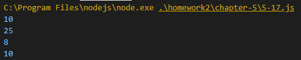

### 5-18 커링함수: 인자가 많아질수록 가독성이 떨어진다는 단점
