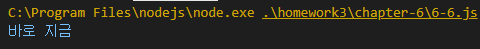

# Internet of Things Homwork #3
## Chapter 6

### 6-1 Pesrson prototype 예제

### 6-2 prototype 예제

### 6-3 Constructor 프로퍼티 예제

### 6-4 Constructor 변경 예제

### 6-5 다양한 Constructor 접근법 예제

### 6-6 메서드 오버라이드 예제

### 6-7 프로토타입 체인 예제

### 6-8 프로토타입 체인 심화 예제
- 자바스크립트 엔진은 데이터 자신의 프로퍼티들을 검색해서 원하는 메소드가 있으면 그 메소드를 실행하고, 없으면 __proto__를 검색해서 있으면 그 메소드를 실행하고, 없으면 다시 __proto__를 검색해서 실행하는 식으로 진행 

### 6-9 객체 전용 메소드의 에외사항 (Object.prototype에 추가한 메소드에 접근)
