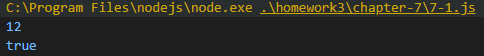
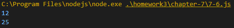

# Internet of Things Homwork #3
## Chapter 7

### 7-1 자바스크립트의 클래스 예제

### 7-2 Grade 생성자 함수 및 인스턴스 예제

### 7-3 Length 프로퍼티 예제

### 7-3(1) Length 프로퍼티를 삭제한 경우
.PNG)

### 7-4 Grade.prototype에 요소를 포함하는 배열을 매칭, Length 프로퍼티를 삭제

### 7-5 Rectangl, Square class 예제

### 7-6 Rectangl, Square class trans 예제

### 7-7 Rectangl을 상속하는 Square Class 예제

### 7-8 클래스 상속 및 추상화 방법(1) - 인스턴스 생성 후 프로퍼티 제거 예제

### 7-9 클래스 상속 및 추상화 방법(2) - 빈 함수를 활용한 방법

### 7-10 상속 방법

### 7-11 ES5에서 상속을 하는 방법(1) - 인스턴스 생성후 프로퍼티 제거

### 7-12 ES5에서 상속을 하는 방법(2) - 빈 함수를 활용

### 7-13 ES5에서 상속을 하는 방법(3) - Object.create 활용
